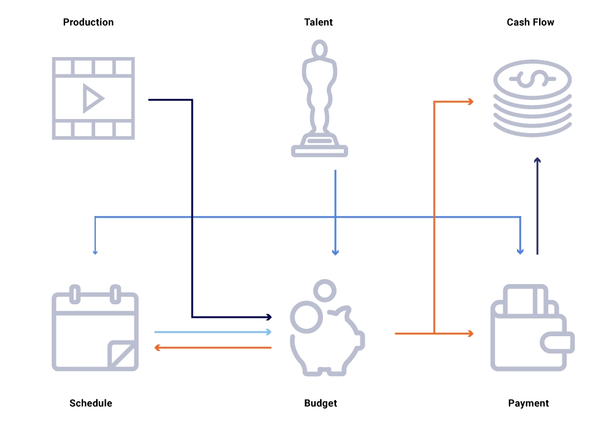
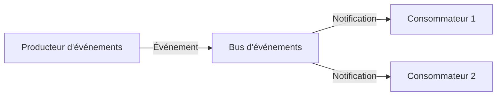

# Réaction par Événements dans un Système

Dans une architecture orientée événements, les composants du système communiquent et réagissent de manière **asynchrone**. Cela permet une meilleure **scalabilité**, une **réactivité accrue** et une gestion efficace des processus en temps réel.

---

## Avantages

- **Découplage** des composants : chaque service peut évoluer indépendamment.
- **Scalabilité** : adaptation facile à la charge.
- **Réactivité** : traitement immédiat des événements entrants.
- **Tolérance aux pannes** : les erreurs dans un composant n'affectent pas l'ensemble du système.

---

## Cas d'Utilisation

- **Traitement des données en temps réel**  
    (ex : analyse de flux de données, détection d'anomalies)
- **Systèmes basés sur les microservices**
- **Applications IoT (Internet des objets)**
- **Systèmes nécessitant des niveaux élevés de concurrence et de réactivité**  
    (ex : plateformes de streaming, messagerie instantanée)

---

## Exemples d'Utilisateurs

- **Netflix** : utilise une architecture orientée événements pour gérer la diffusion de contenu, la recommandation personnalisée et la résilience du service.

---

## Schéma Simplifié

---

## À retenir

L'architecture orientée événements est idéale pour les systèmes nécessitant **flexibilité**, **réactivité** et **évolutivité**.

## Source

[estuary.dev - Event-Driven Architecture Examples](https://estuary.dev/blog/event-driven-architecture-examples/)