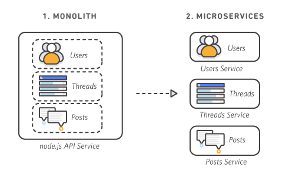

# Monolitique

### Def
Une architecture monolithique est un modèle de développement logiciel traditionnel qui utilise une base de code unique pour exécuter plusieurs fonctions métier.

### Image

### Caractéristiques

| Catégorie      | Architecture monolithique                                                                                  | Architecture de microservices                                                                                                                                         |
|----------------|-------------------------------------------------------------------------------------------------------------|----------------------------------------------------------------------------------------------------------------------------------------------------------------------|
| **Conception** | Base de code unique avec plusieurs fonctions interdépendantes.                                             | Composants logiciels indépendants dotés de fonctionnalités autonomes qui communiquent entre eux à l'aide d'API.                                                      |
| **Développement** | Nécessite moins de planification au départ, mais devient de plus en plus complexe à comprendre et à maintenir. | Nécessite davantage de planification et d'infrastructure au départ, mais devient plus facile à gérer et à maintenir dans la durée.                                    |
| **Déploiement** | Application complète déployée en tant qu'entité unique.                                                    | Chaque microservice est une entité logicielle indépendante qui nécessite un déploiement conteneurisé individuel.                                                     |
| **Débogage**   | Suivre l'exécution du code dans le même environnement.                                                      | Nécessite des outils de débogage avancés pour suivre l'échange de données entre plusieurs microservices.                                                             |
| **Modification** | Les petites modifications présentent de plus grands risques, car elles ont un impact sur l'ensemble de la base de code. | Vous pouvez modifier des microservices individuels sans affecter l'ensemble de l'application.                                                                        |
| **Mise à l'échelle** | Vous devez mettre à l'échelle l'ensemble de l'application, même si certains domaines seulement subissent une augmentation de la demande. | Vous pouvez mettre à l'échelle des microservices individuels en fonction des besoins, ce qui permet d'économiser les coûts globaux de dimensionnement. |
| **Investissement** | Faible investissement initial au prix d'efforts accrus en matière d'entretien et de maintenance.          | Investissement en temps et en coûts supplémentaires pour configurer l'infrastructure requise et renforcer les compétences de l'équipe. Économies à long terme.        |

### Exemples d'utilisation dans des projets connus

- PrestaShop
- WordPress
- Facebook (au début)

###### Source :
- https://aws.amazon.com/
- https://devdocs.prestashop-project.org/8/development/architecture/
- https://www.ropstam.com/headless-wordpress-breaking-the-monolith/
- https://medium.com/@salim.elakoui/the-evolution-of-facebooks-software-architecture-over-time-39ddbe83527a
